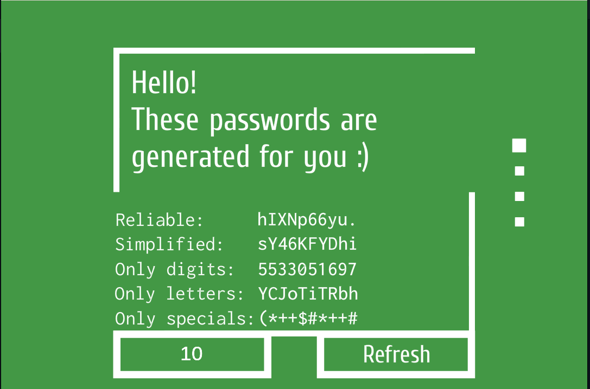
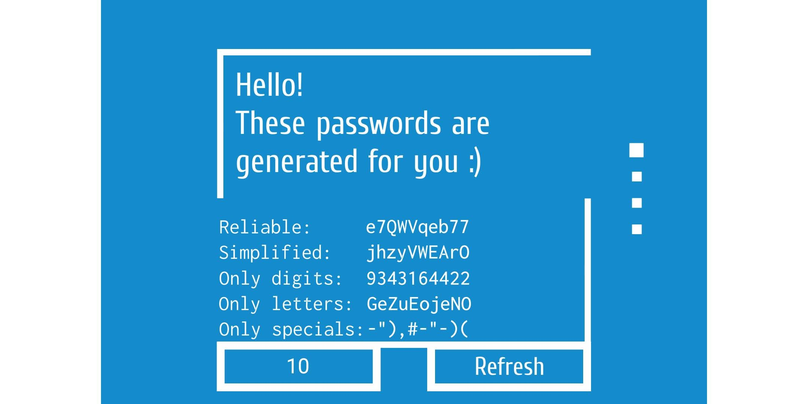
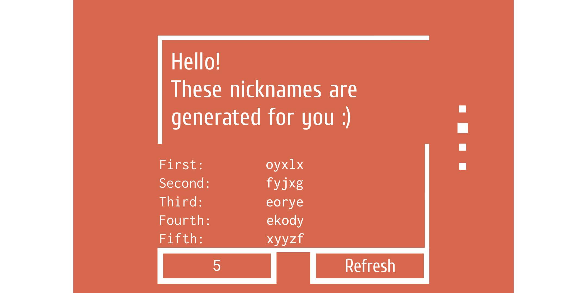
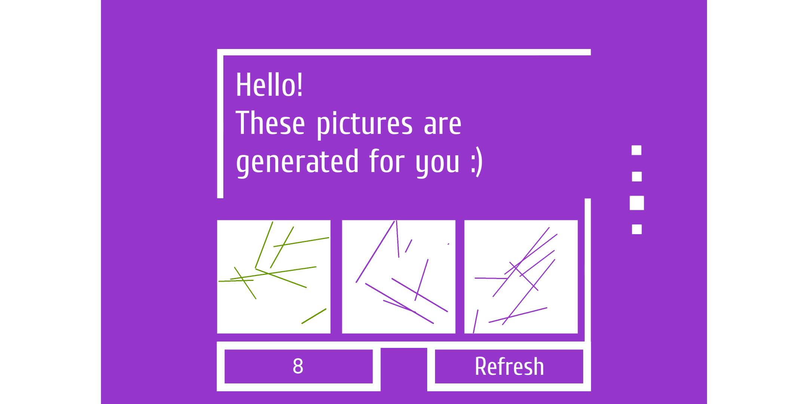

# Dsgen

A legacy project which allows to generate reliable passwords, adorable nicknames and beautiful abstract paintings. The original version of the app was created in 2014 with help of `Adobe Flash` technology which is currently deprecated. However, the projects has a historical value and may be useful for developing similar applications using contemporary platforms. Below there is a screenshot of the app interface, on which can be seen multiple generated passwords, anyone of which can be copied and used for authentication purposes.



## Prerequisites

The source code is kept inside file `app.fla`, which is recommended to open via `Flash Professional CS6` editor from `Adobe`.

The folder `dependencies` contains external libraries which are required for publishing the project.

## Running the app

The compiled version may be launched via `Adobe Flash Player` (file `dsgen.swf`). Since the player is deprecated and currently hard to install separately, it is recommended to run the app as an `exe` file which contains an embedded tool.  

The app also works perfectly on `linux` through `wine` (was tested on `Ubuntu 22.04`). All you need to do is to install wine and run the executable using the following commands respectively:

```sh
sudo apt install wine -y 
wine release/dsgen.exe
```

The app can be run on android as well (requires `Adobe Air`). The following screenshots demonstrate the app interface appearance on an android device.




